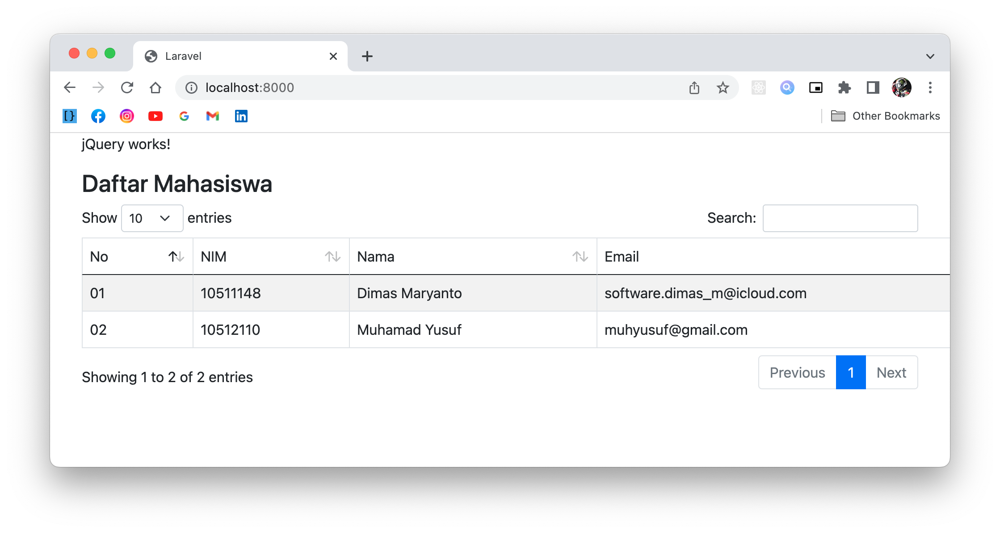
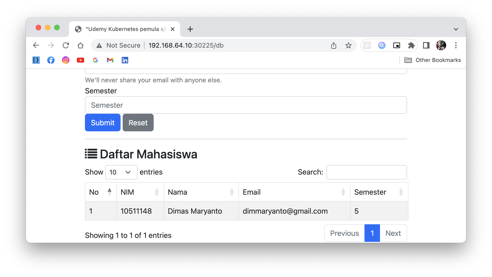

## Test Cloud Native with Monolith Architecture

repository ini digunakan untuk peserta maggang DevOps Engineer. Soal / Quis dibagi jadi 3

1. Containerize web framework (docker)
2. Continues Integration (CI) (gitlab-ci)
3. Orchestration container system (kubernetes)
4. Kubernetes cluster administration

### Containerize web framework

Salah satu pilar Cloud Native adalah container, contohnya disini kita sudah develop aplikasi bisnis kemudian buat containernya dengan spesifikasi

- Web framework
    - PHP 8.1
    - Laravel 8
    - Node 16  (frontend laramix)

- Dependency
    - mysql 8.0

- OS package
    - git 
    - mysql-client
    - openssl
    - zip 

- php-extension
    - fileinfo 
    - exif 
    - pcntl 
    - bcmath 
    - gd 
    - mysqli 
    - pdo_mysql

Build script:

- Install dependency `composer install`
- Install frontend dependency `npm install`
- Build frontend `npm build production`

Run application:
- Copy `.env` file: `php -r "file_exists('.env') || copy('.env.example', '.env');"`
- Generate key: `php artisan package:discover --ansi && php artisan key:generate --ansi --force`
- Refresh config key: `php artisan optimize`

Task:
1. Buat `Dockerfile` untuk buat docker image
2. Buat `docker-compose.yaml` untuk mempermudah mejalankan container `webapps` dan dependency seperti `mysql` database dan lain-lain
3. Jalankan container tersebut, menggunakan perintah `docker compose up -d` kemudian coba check
    1. untuk endpoint `/` seperti berikut hasilnya:
        
    2. untuk endpoint `/db` seperti berikut hasilnya:
        
3. jika sudah jalan containernya di local, Push ke docker registry (docker hub) dengan nama image `user-docker-hub/quis-cloud-native-monolith:v1`

### Continues Integration (CI)

Setelah build container, tahap selanjutnya buat automation build docker image menggunakan CI/CD tools seperti gitlab ci.

Task:

Buat `.gitlab-ci.yml` untuk melakukana beberapa jobs:

1. Build frontend (laramix)
2. Build docker image yang di push ke private registry
    - url: `192.168.100.250:8087` user: `tabeldata` password: `tabeldata`
    - docker image tag: `192.168.100.250:8087/maggang.tabeldata.com/<username>/quis-cloud-native-monolith:v1`
3. Jalankan database migration `php artisan migrate`